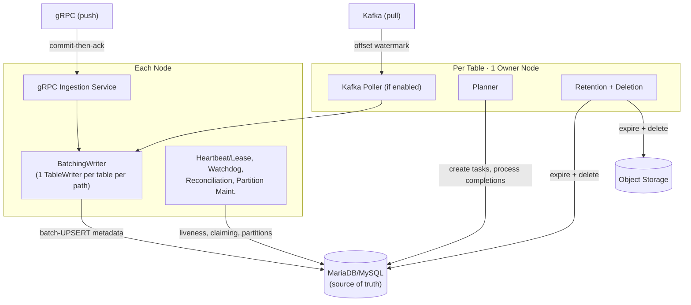
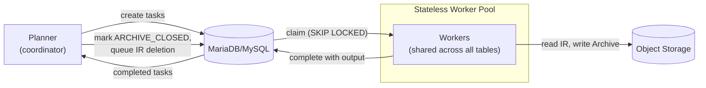

# CLP Metastore Service

Metadata ingestion, query optimization, and lifecycle management for [CLP](https://github.com/y-scope/clp). Persists file metadata in MariaDB/MySQL and orchestrates consolidation, retention, and partitioning — the foundation for scalable storage, retrieval, and highly optimized precise and semantic search across tens to hundreds of petabytes.

## What this enables

CLP compresses data 10–30x beyond gzip while keeping it directly queryable — but at petabyte scale with billions of files, the query engine needs to know which files to open and search, how to rank them, and when to stop looking. The metastore is that layer: it tracks every file, promotes the most useful internal metadata into database columns, and gives the query engine the information it needs to prune non-matching files, rank candidates, and terminate early — turning full scans into targeted lookups.

Beyond search, the metastore orchestrates the processing that makes data progressively more searchable: consolidating streaming IR files into columnar Archives with richer semantic extraction, labeling, and sketch filter construction — plus retention, cleanup, and automatic schema evolution. Together with CLP's in-file metadata, it enables multi-layered search across hundreds of petabytes. In short, the metastore is what lets CLP run as a service — much like Iceberg, Delta Lake, and Hudi need a catalog and metadata layer to operate as managed table formats.

## What is it?

CLP Metastore Service is the metadata, lifecycle, and query-optimization layer for CLP. The core metastore is low-resource — it ingests file metadata, promotes the most useful fields into database columns for fast filtering, and manages retention. Stateless workers consolidate streaming, queryable Intermediate Representation (semantically compressed at the edge) into columnar Archives with semantic enrichment and higher compression. Together, they enable CLP's query engine to find the right files without opening them.

The architecture is designed for high performance and reliability with minimal moving parts: MariaDB/MySQL is the single source of truth for metadata and task distribution, and coordinators use database-backed leases for leader election and failover — no etcd, ZooKeeper, or additional distributed services, even for HA. Idempotent UPSERTs, forward-only state transitions, and monotonic lifecycle progression ensure safe crash recovery and replay at every layer.

### CLP in brief

Current systems force a trade-off: index everything for fast queries (Elasticsearch, ClickHouse, Snowflake, Pinot) but pay for storage that scales with volume. Or apply opaque compression (gzip, zstd) for cheap storage but lose queryability — any search requires full decompression back to the original data. [CLP](https://github.com/y-scope/clp) offers a different path: at the same throughput (typically 15–150 MB/s per core), CLP achieves significantly better compression ratios than gzip and zstd — and easily surpasses their maximum compression ratios even at their highest (slowest) compression levels. Additionally, the compressed data remains directly queryable.

CLP uses lossless semantic compression — instead of finding repeated byte sequences, it understands the structure and meaning of the data. It groups semantically similar data together and uses [log-surgeon](https://github.com/y-scope/log-surgeon) for automated semantic extraction and labeling, without pre-defining format or regex patterns for each record or document. It separates low-cardinality format strings from variable fields, and beyond that, semantically identifies and labels variables (e.g., recognizing a trace ID, IP address, or pod name) wherever they appear — within a field value, across field values, or embedded in unstructured text. The extracted structure is stored in columnar format.

The result: [~32x compression](https://www.usenix.org/conference/osdi21/presentation/rodrigues) — significantly higher on verbose data or during incidents, where repetitive patterns appear in much larger volume. Every original byte and its temporal ordering are preserved (fully lossless), though temporal ordering can optionally be relaxed for additional compression. CLP handles any textual data without requiring a predefined schema: application logs, in-memory data structures, agent execution traces and reasoning chains, audit events, or any append-only timestamped records. The approach scales to tens to hundreds of petabytes.

### Why a new metastore?

CLP is file-based, not row-based — architecturally closer to table formats like Iceberg, Delta Lake, and Hudi than to row-oriented databases. Like those formats, it needs a metastore to track files, manage metadata, and optimize queries. But traditional metastores assume schema-on-write with fixed columns defined upfront. CLP's requirements differ in three ways:

- **Schema-less semantic compression** — fields appear and disappear, the same field can have different types across records (type polymorphism), and multiple conflicting schemas coexist simultaneously. This demands a purpose-built file format — schema-less semantic compression cannot be expressed in traditional formats like Parquet. CLP files contain rich internal metadata beyond what existing metastores can represent, leaving significant query optimization on the table — such as advanced metadata-level TopN early termination.
- **High-throughput mutable metadata** — unlike traditional metastores that treat metadata as immutable snapshots, CLP's file metadata is continuously updated: state, counts, and dimensions change as files progress through their lifecycle. The metastore sustains 10K+ upserts per second per ingestion thread, scales to billions of files per table and dozens of tables per database, with a small operating footprint (e.g., 4 cores, 32 GB RAM per node, or a handful of these nodes with HA enabled).
- **Streaming and lifecycle-aware** — traditional metastores treat file formats as interchangeable storage options. In CLP, format is a lifecycle stage: IR (Intermediate Representation) is a lightweight, streamable, appendable format for buffering and streaming, while Archives are the columnar format optimized for analytical queries. Consolidation from IR to Archive is largely a row-to-column transposition with richer metadata construction (semantic enrichment, PII handling, sketch filters). Both formats are directly queryable.

### What CLP files already know

CLP files contain rich internal metadata covering most fields in the data:

- **Merged Parse Trees (MPTs)** — discovered field names, types, nesting, and relationships (parent-child, sibling) for each file.
- **Encoded record table (ERT) schemas** — each ERT schema is a unique set of MPT leaf nodes, so records sharing that same set of leaf nodes can be decomposed and stored in columnar format. The schema metadata lets the query engine target only the relevant ERTs for a given query.
- **Format string indexes** — format patterns automatically inferred at compression time, with semantically extracted and named variable placeholders (e.g., `pod_name`, `container_id`, `trace_id`) in addition to generic placeholders (e.g., `timestamp`, `ip_address`, `int`, `float`). Each placeholder encodes the position, type, and meaning of its variable within the format string, enabling pattern-based search and semantic queries without scanning raw text.

### What the metastore adds

The metastore promotes the most useful subset of CLP's internal metadata into database columns for metadata-layer query optimization, significantly reducing the need to open files:

- **Dimension columns** (`dim_*`) — file-level constants (values identical across every record in a file), enabling multi-dimensional filtering without opening the underlying data.
- **Aggregation columns** (`agg_*`) — per-file aggregates for arbitrary filter criteria: exact match counts (e.g., level = ERROR), cumulative threshold counts (e.g., level >= WARN), and numeric aggregates (min, max, sum, avg). Physical names use opaque placeholders (`agg_f01`, `agg_f02`, ...); the logical mapping is stored in `_agg_registry`.
- **Sketch columns** — bloom and cuckoo filters for high-cardinality fields (trace_id, user_id), enabling probabilistic pruning of non-matching files.

For fields not promoted to the metastore, queries can still leverage CLP's MPTs and ERTs inside the file — requires opening it, but far faster than scanning raw data. New dimensions and aggregations are discovered automatically via online schema evolution, with no manual migrations.

Together, the metastore's promoted columns and CLP's internal file metadata enable multi-layered semantic search that scales to tens to hundreds of petabytes: prune and rank at the metastore, narrow within the file via MPTs and ERTs, and scan raw data only as a last resort — in addition to traditional filter-based queries.

### Advanced TopN early termination

The promoted metadata columns also enable **advanced TopN early termination**. Basic TopN uses only record counts per file and timestamps to rank files — sufficient when there are no filter conditions. This metastore extends that: queries can combine any `dim_*` columns for split pruning, any `agg_*` columns to know how many matching records each file contains, and sketch filters to eliminate non-matching files — then rank the remaining by time and relevance and stop once enough results are guaranteed.

Traditional metastores are limited to split pruning alone: skip files that *definitely don't match*, then scan *all remaining files* for results.

## Quick Start

Prerequisites: Docker, JDK 17+, Maven 3.9+

```bash
# Start infrastructure (MariaDB, Kafka, MinIO) and coordinator nodes
./docker/start.sh -d

# Build
mvn clean package -DskipTests

# Run the node (coordinator + workers in one JVM)
java -jar target/clp-service-1.0-SNAPSHOT.jar

# Or specify a config file
java -jar target/clp-service-1.0-SNAPSHOT.jar config/node.yaml
```

See [Quickstart](docs/getting-started/quickstart.md) for detailed setup, validation, and an end-to-end tutorial.

## Architecture

The service has two roles: **coordinator nodes** that ingest metadata and manage table lifecycles, and **stateless workers** that execute consolidation tasks. MariaDB/MySQL is the single source of truth — coordinators write metadata, workers claim tasks, and both read from it. In production, the roles run as separate JVM processes; for development and testing, they colocate in a single Node JVM.

### Coordinator Node



**Each Node** runs the gRPC Ingestion Service, BatchingWriter, and HA & Maintenance. Both gRPC and Kafka feed into the `BatchingWriter`, which lazily creates one `TableWriter` thread per active table per path and batch-UPSERTs metadata to the database.

- **gRPC** — multiple nodes can write metadata for the same table concurrently. Write to DB, then acknowledge to client (commit-then-ack).
- **Kafka** — only the table's owner node runs the Kafka Poller. Advance consumer offset after batch commit (offset watermark).

**Per Table · 1 Owner Node** — each table is owned by exactly one node at a time (assigned via database-backed leases, can move between nodes for failover). The owner runs the Kafka Poller (if enabled), Planner (creates consolidation tasks, processes completions), and Retention + Deletion (expires data from DB and object storage) for that table.

### Worker Pool



Workers are stateless processes shared across all tables. The task lifecycle:

1. The **Planner** creates a consolidation task — the task `payload` packages everything the worker needs (IR file paths, archive destination, storage backend).
2. A **worker** claims the task via `FOR UPDATE SKIP LOCKED`, reads IR files from object storage, and creates an Archive.
3. The **worker** writes the archive to object storage and marks the task completed.
4. The **Planner** processes completions: updates metadata to `ARCHIVE_CLOSED`, removes IR paths from the in-flight set, and queues IR files for storage deletion.

For the full system design — data lifecycle, end-to-end data flow, and deployment — see [Architecture Overview](docs/concepts/overview.md). For coordinator deep dives, see [Coordinator HA](docs/design/coordinator-ha.md) (failover, liveness, edge cases) and [Deploy HA](docs/guides/deploy-ha.md) (operational setup).

## Features

- **Idempotent by design** — UPSERTs are safe to replay, file states can only progress forward (never regress), and all lifecycle transitions are monotonic — gRPC clients safely resend on timeout, Kafka replays from the last committed offset, workers safely re-claim timed-out tasks
- **Dual ingestion** — concurrent gRPC (push) and Kafka (pull)
- **Automatic schema evolution** — new `dim_*` and `agg_*` columns discovered on the fly via online DDL
- **Per-table coordinators** — gRPC writers on any node (load-balanced, sticky sessions preferred); owner runs Kafka poller, planner, retention, and deletion
- **Database-backed task queue** — workers claim tasks via `FOR UPDATE SKIP LOCKED` for lock-free scaling
- **Daily partitioning** — automatic partition creation/merge with configurable lookahead
- **Pluggable record transformers** — normalize different Kafka producer schemas at ingestion time
- **Multi-backend storage** — MinIO/S3-compatible object storage with configurable backends
- **Declarative table registration** — define tables in YAML, auto-UPSERTed to the registry on startup

## Documentation

<table>
<thead>
<tr><th>Category</th><th>Document</th><th>Description</th></tr>
</thead>
<tbody>
<tr><td rowspan="2">Getting Started</td><td><a href="docs/getting-started/quickstart.md">Quickstart</a></td><td>Prerequisites, build, run, verify</td></tr>
<tr><td><a href="docs/getting-started/tutorial-ingestion.md">Tutorial: Ingestion</a></td><td>End-to-end Kafka ingestion walkthrough</td></tr>
<tr><td rowspan="9">Concepts</td><td><a href="docs/concepts/data-model.md">Data Model</a></td><td>What data CLP handles, file formats, deployment modes</td></tr>
<tr><td><a href="docs/concepts/overview.md">Architecture Overview</a></td><td>System overview, data lifecycle, thread model</td></tr>
<tr><td><a href="docs/concepts/metadata-schema.md">Metadata Schema</a></td><td>Entry types, lifecycle, denormalization, partitioning</td></tr>
<tr><td><a href="docs/concepts/ingestion.md">Ingestion Paths</a></td><td>gRPC and Kafka ingestion, BatchingWriter</td></tr>
<tr><td><a href="docs/concepts/consolidation.md">Consolidation</a></td><td>IR→Archive pipeline, policies, worker workflow</td></tr>
<tr><td><a href="docs/concepts/task-queue.md">Task Queue</a></td><td>Database-backed task queue, claim protocol, recovery</td></tr>
<tr><td><a href="docs/concepts/query-execution.md">Query Execution</a></td><td>Pruning pipeline, early termination, query catalog</td></tr>
<tr><td><a href="docs/concepts/semantic-extraction.md">Semantic Extraction</a></td><td>log-surgeon, MPT, ERTs, LLM-powered schema generation</td></tr>
<tr><td><a href="docs/concepts/glossary.md">Glossary</a></td><td>CLP terminology and definitions</td></tr>
<tr><td rowspan="6">Guides</td><td><a href="docs/guides/configure-tables.md">Configure Tables</a></td><td>Table registration, feature flags</td></tr>
<tr><td><a href="docs/guides/deploy-ha.md">Deploy HA</a></td><td>Coordinator HA setup, heartbeat vs lease</td></tr>
<tr><td><a href="docs/guides/scale-workers.md">Scale Workers</a></td><td>Worker pool scaling, Docker Compose</td></tr>
<tr><td><a href="docs/guides/evolve-schema.md">Evolve Schema</a></td><td>Online DDL, adding dimensions and aggregates</td></tr>
<tr><td><a href="docs/guides/integrate-clp.md">Integrate CLP</a></td><td>Worker-CLP binary integration</td></tr>
<tr><td><a href="docs/guides/write-transformers.md">Write Transformers</a></td><td>Normalizing Kafka producer schemas</td></tr>
<tr><td rowspan="6">Reference</td><td><a href="docs/reference/grpc-api.md">gRPC API</a></td><td>gRPC services, proto messages, filter expressions</td></tr>
<tr><td><a href="docs/reference/configuration.md">Configuration</a></td><td>node.yaml, env vars, API server config</td></tr>
<tr><td><a href="docs/reference/metadata-tables.md">Metadata Tables</a></td><td>DDL, column reference, index reference</td></tr>
<tr><td><a href="docs/reference/naming-conventions.md">Naming Conventions</a></td><td>Column, index, file, and state naming patterns</td></tr>
<tr><td><a href="docs/reference/platform-comparison.md">Platform Comparison</a></td><td>CLP vs Iceberg, Elasticsearch, ClickHouse, Loki</td></tr>
<tr><td><a href="docs/reference/research.md">Research Papers</a></td><td>Academic papers behind CLP</td></tr>
<tr><td rowspan="4">Operations</td><td><a href="docs/operations/performance-tuning.md">Performance Tuning</a></td><td>Benchmarks, JDBC gotchas, index strategy</td></tr>
<tr><td><a href="docs/operations/port-configuration.md">Port Configuration</a></td><td>Customizing infrastructure and application ports</td></tr>
<tr><td><a href="docs/operations/deployment.md">Deployment</a></td><td>Production deployment patterns</td></tr>
<tr><td><a href="docs/operations/monitoring.md">Monitoring</a></td><td>Health checks, metrics, alerting</td></tr>
<tr><td rowspan="4">Design</td><td><a href="docs/design/coordinator-ha.md">Coordinator HA</a></td><td>Edge cases, walkthroughs, design alternatives</td></tr>
<tr><td><a href="docs/design/early-termination.md">Early Termination</a></td><td>Runnable example, Presto integration, streaming cursors</td></tr>
<tr><td><a href="docs/design/keyset-pagination.md">Keyset Pagination</a></td><td>PK-based keyset cursor design</td></tr>
<tr><td><a href="docs/design/nl-query-planner.md">NL Query Planner</a></td><td>Natural language to KQL translation</td></tr>
</tbody>
</table>

## Configuration

Configuration is split between `node.yaml` (node-level settings) and the database (per-table config). Tables can be declared in YAML for automatic registration on startup. See [Configuration Reference](docs/reference/configuration.md) for the full reference.

## Building & Testing

```bash
# Build (skip tests)
mvn clean package -DskipTests

# Run all tests
mvn test

# Run a specific test
mvn test -Dtest=SparkJobPolicyTest
```

## License

Apache 2.0 — see [LICENSE](LICENSE).
