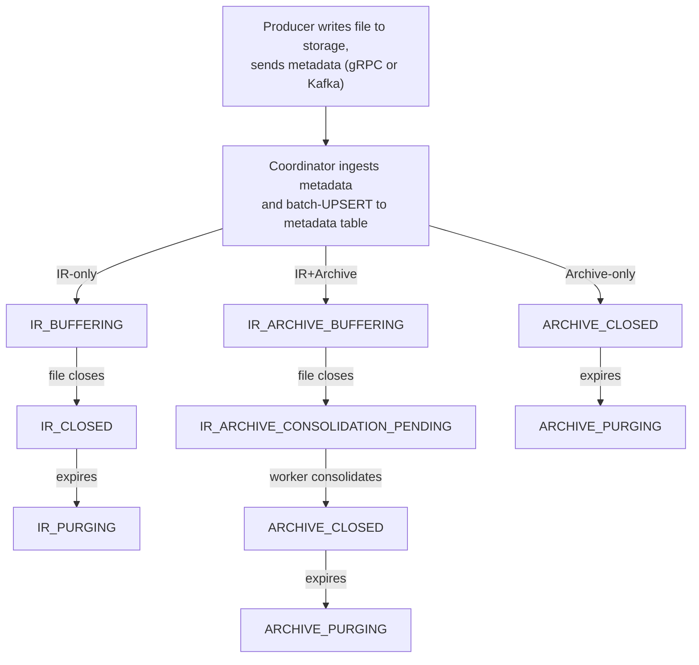

# Deletion & Lifecycle

[← Back to docs](../README.md)

Files progress through forward-only lifecycle states from ingestion to deletion. Each file's entry type determines its initial state and the transitions it will follow. States never regress — once a file advances past a state, late re-deliveries or retries cannot move it backward. This document covers the full lifecycle, retention semantics, and storage cleanup.

**Related:** [Metadata Schema](metadata-schema.md) · [Consolidation](consolidation.md) · [Architecture Overview](overview.md) · [Naming Conventions](../reference/naming-conventions.md)

---

## File Lifecycle States

Seven states, organized by file format:

| State | Entry Type | Description |
|-------|-----------|-------------|
| `IR_BUFFERING` | IR-only | IR file actively receiving writes |
| `IR_CLOSED` | IR-only | IR file closed, queryable, awaiting retention expiry |
| `IR_PURGING` | IR-only | IR file being deleted from storage |
| `IR_ARCHIVE_BUFFERING` | IR+Archive | IR file actively receiving writes, will be consolidated |
| `IR_ARCHIVE_CONSOLIDATION_PENDING` | IR+Archive | IR file closed, awaiting consolidation into archive |
| `ARCHIVE_CLOSED` | Archive-only or IR+Archive | Archive ready (from batch upload or after consolidation) |
| `ARCHIVE_PURGING` | Archive-only or IR+Archive | Archive being deleted from storage |



All transitions are forward-only. The UPSERT guard (`state NOT IN (...)` + timestamp guard) prevents late re-deliveries from regressing state. See [Metadata Schema: UPSERT Strategy](metadata-schema.md#upsert-strategy).

---

## Entry Types

The entry type is determined at file creation and controls which lifecycle path the file follows.

### IR-only

Ephemeral data (test logs, short-lived debug streams) that expires without consolidation.

```
IR_BUFFERING → IR_CLOSED → IR_PURGING → (deleted)
```

The IR file is queryable from `IR_BUFFERING` onward. After retention expires, the coordinator marks the row `IR_PURGING`, the Storage Deletion goroutine removes the file from object storage, and the row is deleted.

### Archive-only

Batch-ingested archives with no source IR file. Created directly as `ARCHIVE_CLOSED`.

```
ARCHIVE_CLOSED → ARCHIVE_PURGING → (deleted)
```

### IR+Archive

Streaming data that will be consolidated into a columnar archive. This is the most common production path.

```
IR_ARCHIVE_BUFFERING → IR_ARCHIVE_CONSOLIDATION_PENDING → ARCHIVE_CLOSED → ARCHIVE_PURGING → (deleted)
```

After consolidation completes, the source IR file in object storage is scheduled for deletion. The metastore row transitions to `ARCHIVE_CLOSED` with `archive_path` set — `file_path` is preserved in the row as provenance. The many-to-one relationship (multiple IR files per archive) is tracked via the shared `archive_path` value. See [Consolidation: IR to Archive Relationship](consolidation.md#ir-to-archive-relationship).

---

## Retention

### How `expires_at` is Set

`expires_at` is a required field in the database (no default). If the producer provides `expires_at`, that value is used as-is. If the producer sends `expires_at = 0` (or omits it), the coordinator computes it server-side as `min_timestamp + (retention_days × 86400 × 1e9)` (epoch nanoseconds). If `retention_days` is also zero, it defaults to 30 days. Because `min_timestamp` is the partition key, this creates a strong temporal correlation: files in old partitions expire sooner; files in new partitions expire later.

### Per-File Retention Updates

Retention is managed at **file granularity** — each row carries its own `expires_at`. This can be updated at any time via standard SQL, using any combination of dimensions, time ranges, or other predicates:

```sql
-- Extend retention during a security incident
UPDATE clp_spark
SET retention_days = 395, expires_at = min_timestamp + (395 * 86400 * 1000000000)
WHERE dim_str128_service = 'auth-service'
  AND min_timestamp >= [INCIDENT_START]
  AND min_timestamp <= [INCIDENT_END]
  AND retention_days < 395
LIMIT 10000;
```

This is a first-class operational capability — no special API required. Any database query that selects the right subset of files can update their retention. Common use cases:

| Scenario | Filter | Action |
|----------|--------|--------|
| Security incident | Service + time range | Extend retention for forensic analysis |
| Compliance hold | Dimension (region, customer) | Prevent deletion of regulated data |
| Cost reduction | Large services past SLA | Shorten retention |
| Debug investigation | Specific host/job + time window | Extend retention temporarily |

### Deletion Ordering

Deletions are row-level, driven by `idx_expiration` (scan `expires_at ASC`, batch delete). Each file carries its own `expires_at` reflecting its individual retention policy. Because `expires_at` correlates with `min_timestamp`, deletions cluster in the oldest (coldest) partitions — never in the hot recent partition. Deletions proceed in roughly storage order: the oldest rows in the oldest partition expire first, matching their physical B-tree position.

### Why Fragmentation is Benign

- Deletions are batched in large chunks in roughly storage order, so most pages drain completely within one or a few batch operations. InnoDB reclaims fully empty pages whole.
- Page compression with `PUNCH_HOLE` handles partially-drained pages: as rows are deleted, the compressed size shrinks, and InnoDB returns freed filesystem blocks to the OS.
- All fragmentation stays in cold, old partitions — the hot recent partition is unaffected.

---

## Retention Strategy

Each coordinator runs a **Retention Strategy** goroutine per table when `retention.enabled` is `true` in the table config (default: enabled). The strategy type is configured per-table via `retention.type` in the `_table_config` config blob (default: `"default"`). See [Config Schema](../guides/configure-tables.md#config-schema).

### How It Works

The default retention strategy runs a three-phase cleanup cycle every 60 seconds:

1. **Phase 1 — Transition**: Scan for expired rows (`expires_at < now`, state = `IR_CLOSED` or `ARCHIVE_CLOSED`) and mark them `PURGING` (`IR_PURGING` or `ARCHIVE_PURGING`). This is a crash-safe marker — the transition is durable in the database.
2. **Phase 2 — Delete metadata**: Delete `PURGING` rows from the database, collecting storage paths (IR and archive) for cleanup.
3. **Phase 3 — Delete storage**: Remove files from object storage at a rate-limited pace (best-effort, idempotent).

### Crash Safety via PURGING States

The three-phase process provides crash safety:

- If the coordinator crashes after marking `PURGING` but before storage deletion, the next owner's retention strategy finds all `PURGING` rows and retries from Phase 2.
- If the coordinator crashes after storage deletion but before row deletion, recovery deletes the orphan row (the storage file is already gone).
- The `PURGING` state is durable in the database, so no deletion is lost across restarts or HA failover.

### Rate Limiting

Storage deletion is rate-limited to 500 operations per second to avoid overwhelming object storage during bulk expiration events. This is an internal parameter — not exposed to users.

### Extensibility

Retention strategies use a two-level registry pattern (same as storage backends):

1. **Compile-time registration** — each strategy implementation registers itself via `init()` with a type name and factory function.
2. **Runtime instantiation** — when a coordinator starts, it reads `retention.type` from the `_table_config` config blob and creates the corresponding strategy instance.

Custom strategies can implement throttling, grace periods, or alternative cleanup policies by registering a new type and setting `retention.type` on the table.

---

## Partition Cleanup

After the retention strategy deletes expired rows, old partitions become empty or sparse. The `PartitionManager` — running as a per-coordinator goroutine hourly — drops empty partitions and merges sparse partitions into `p_floor`.

| Condition | Action |
|-----------|--------|
| Empty (0 rows) | Drop partition |
| Sparse (has rows) | Merge into `p_floor` via `REORGANIZE PARTITION` |

Only partitions older than the cleanup age (default: 90 days) are candidates. `p_floor` and `p_future` are structural bookends — never dropped or merged away. Empty old partitions are dropped; sparse ones are merged into `p_floor`, expanding its boundary while preserving all rows. For full details on partition layout, advisory lock coordination, and maintenance operations, see [Metadata Schema: Partitioning](metadata-schema.md#partitioning).

---

## See Also

- [Metadata Schema](metadata-schema.md) — Entry types, UPSERT guards, partitioning, retention details
- [Consolidation](consolidation.md) — IR-to-Archive pipeline, state transitions during consolidation
- [Architecture Overview](overview.md) — Goroutine model, startup/shutdown sequences
- [Naming Conventions](../reference/naming-conventions.md) — Lifecycle state naming patterns
- [Task Queue Design](../design/task-queue.md) — How consolidation tasks are claimed and completed
