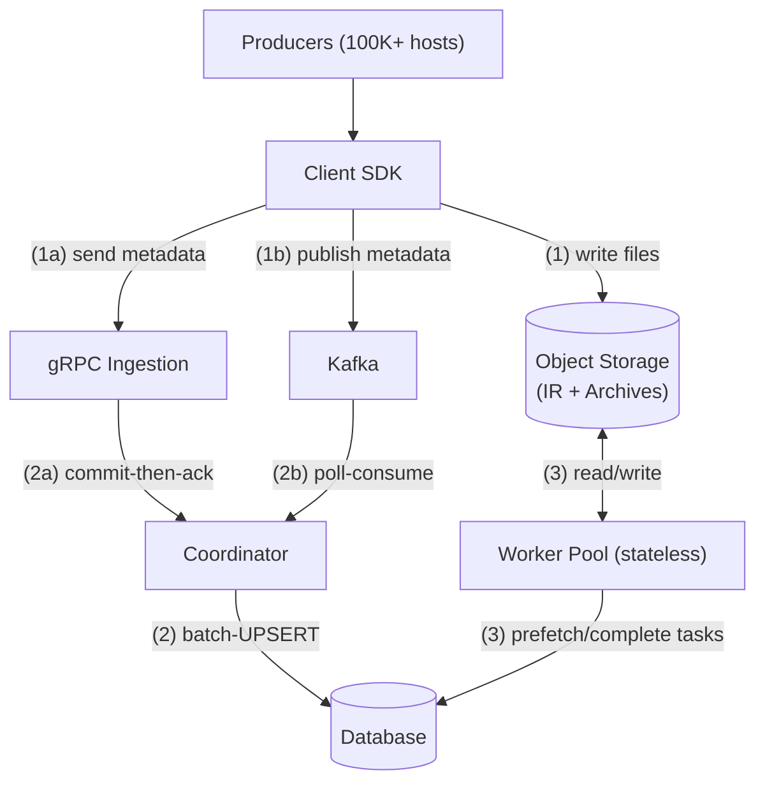
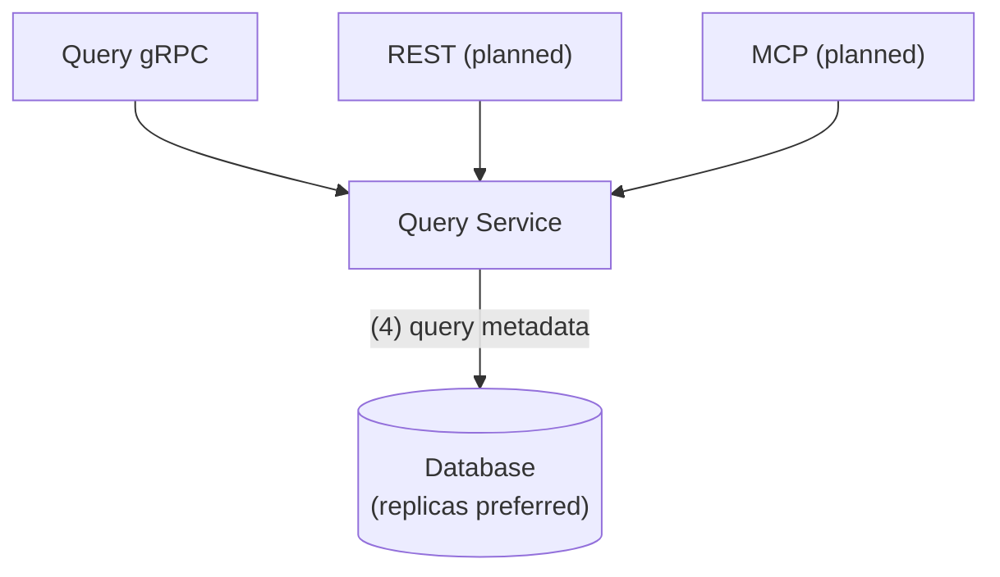
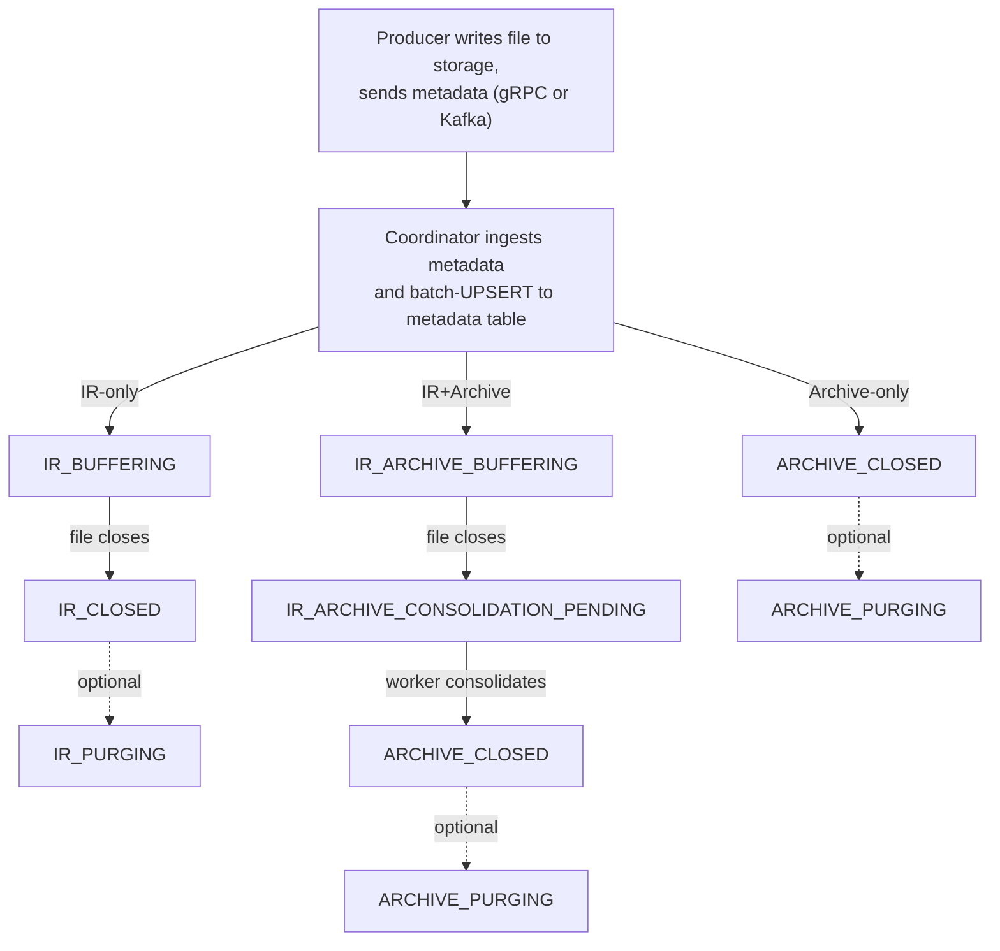

# Architecture Overview

[← Back to docs](../README.md)

End-to-end data flow, data lifecycle, component responsibilities, thread model, and deployment. For a quick visual overview of the coordinator node and worker pool, see the [project README](../../README.md#architecture). For deep dives, see [Coordinator HA](../design/coordinator-ha.md) (failover, liveness, edge cases).

## Design Principles

- **Minimal moving parts** — MariaDB/MySQL is the single source of truth for metadata, task distribution, and leader election. No etcd, no ZooKeeper, no additional distributed services — even for HA.
- **Safe crash recovery** — Idempotent UPSERTs, forward-only state transitions, and monotonic lifecycle progression mean any component can restart at any time without data loss or corruption.
- **Separation of ingestion and processing** — Coordinators handle metadata writes; stateless workers handle heavy I/O (consolidation). They scale independently and never contend.

---

## End-to-End Data Flow

The [README](../../README.md#architecture) shows coordinator and worker pool internals; this section shows the external data flow.

**Ingestion and processing:**

**Data access:**

**How data flows through the system:**

1. **Ingestion** — the Client SDK writes files (IR or archives) to object storage and sends file metadata to the coordinator via gRPC (push, commit-then-ack) or Kafka (pull, poll-based consumption). IR files may be destined for consolidation into archives or left as-is.
2. **Persistence** — the coordinator batch-UPSERTs metadata to the database and generates workflow tasks (e.g., consolidation).
3. **Processing** — a `TaskPrefetcher` batch-claims tasks from `_task_queue`; workers pull tasks from the in-memory queue, consolidate IR → Archive (semantic extraction and enrichment, PII handling), and report results back for metadata updates.
4. **Data access** — the Query Service exposes metadata via gRPC (REST and MCP planned); queries go to database replicas when available, primary otherwise.

---

## Data Lifecycle

Files exist in two formats, both using schema-free semantic compression. **IR** (Intermediate Representation) is a lightweight, streamable, appendable format semantically compressed at the edge — directly queryable even before consolidation. **Archives** are the equivalent columnar format, optimized for analytical queries and semantic search, with higher compression, richer metadata, and semantic enrichment.

The entry type determines the initial state. When retention expires, the coordinator removes the database row and deletes associated files from object storage asynchronously. The optional purging state adds crash safety: files are marked for deletion in the database before storage cleanup begins, so recovery can complete any interrupted deletions.

---

## Components

### Coordinator

Each table is owned by exactly one node at a time. The owner runs per-table lifecycle threads (Kafka poller, planner, retention, deletion); every node runs shared threads (gRPC ingestion, BatchingWriter, HA & maintenance). Both ingestion paths feed into the BatchingWriter, which batch-UPSERTs metadata to the database. See the [README](../../README.md#architecture) for visual diagrams.

- **[Coordinator HA](../design/coordinator-ha.md)** — database-backed liveness, orphan detection, failover, edge cases
- **[Ingestion Paths](ingestion.md)** — gRPC and Kafka protocols, BatchingWriter, choosing a path

### Workers

Stateless processes that transform IR files into Archives — row-to-column transposition, semantic extraction and enrichment, PII handling, and sketch filter construction. A `TaskPrefetcher` thread batch-claims tasks from the database via `SELECT ... FOR UPDATE` + `UPDATE` (READ COMMITTED isolation) and places them in an in-memory queue; worker threads pull tasks from that queue, execute independently, and report results back. The coordinator's Planner processes completions and applies all metadata updates.

- **[Scale Workers](../guides/scale-workers.md)** — scaling, troubleshooting
- **[Consolidation](consolidation.md)** — IR→Archive pipeline, policies
- **[Task Queue](task-queue.md)** — claim protocol, recovery, performance

### Query Service

Read-only metadata access via gRPC (streaming with early termination), with REST and MCP planned. All protocols share the same `QueryService` implementation. Queries go to database replicas when available, primary otherwise.

- **[gRPC API Reference](../reference/grpc-api.md)** — gRPC services, proto messages, keyset pagination, configuration

### Database

MariaDB 10.6+ or MySQL 8.0+ (auto-detected). The single source of truth for all metadata and coordination: per-table daily-partitioned metadata tables, `_task_queue` for lock-free task distribution, and automatic schema evolution for new `dim_fNN` and `agg_fNN` columns via online DDL.

- **[Metadata Schema](metadata-schema.md)** — entry types, lifecycle, denormalization rationale, partitioning
- **[Metadata Tables](../reference/metadata-tables.md)** — DDL, column reference, index reference
- **[Schema Evolution](../guides/evolve-schema.md)** — placeholder column names, registry tables, online DDL

---

## Thread Model

Threads are split across two levels: **per-coordinator** threads that each CoordinatorUnit owns, and **Node-level** threads shared across all coordinators in the JVM. Per-coordinator threads are individually enabled or disabled via `_table_config` columns.

Workers poll the database directly and are independent of the coordinator thread model. For development and testing, they run as threads inside the Node JVM (`worker.numWorkers` in `node.yaml`); in production, they run as separate JVM processes (see [Scale Workers](../guides/scale-workers.md)). Partition management runs at the node level (see [Metadata Schema: Partitioning](metadata-schema.md#partitioning)).

### Per-Coordinator Threads (4 per table)

Each CoordinatorUnit owns these threads. They are created when a coordinator claims a table and stopped when it releases.

| Thread | Name | Reads From | Writes To | Purpose |
|--------|------|------------|-----------|---------|
| 1 | **Kafka Poller** | Kafka | BatchingWriter queue | Continuous metadata ingestion |
| 3 | **Planner** | Database (MVCC) | _task_queue table, InFlightSet | Task creation, policy evaluation |
| 4 | **Storage Deletion** | DeletionQueue | Object storage | Rate-limited storage cleanup |
| 5 | **Retention Cleanup** | Database | Database | Periodic DELETE of expired rows |

### Node-Level Data Path Threads

On the ingestion critical path. The Node creates these at startup; `TableWriter` threads are lazily spawned per table on first submit.

| Thread | Name | Scope | Purpose |
|--------|------|-------|---------|
| — | **BatchingWriter (kafka)** | 1 `TableWriter` thread per active table | Batch-UPSERT metadata from Kafka pollers |
| — | **BatchingWriter (gRPC)** | 1 `TableWriter` thread per active table | Batch-UPSERT metadata from gRPC ingestion |

### Node-Level HA & Maintenance Threads

Periodic background threads for coordination and housekeeping. Created once at Node startup.

| Thread | Name | Scope | Purpose |
|--------|------|-------|---------|
| — | **Watchdog** | 1 per node | Monitor per-coordinator thread health, restart or release stalled coordinators |
| — | **Heartbeat / Lease Renewal** | 1 per node | HA liveness signal (mode set by `coordinatorHaStrategy`) |
| — | **Reconciliation** | 1 per node | Claim unassigned tables, start/stop coordinator units |
| — | **Partition Maintenance** | 1 per node | Lookahead partition creation and cleanup for all tables |

### Data Flow Paths

**Ingestion Path (gRPC → Database):**

| Step | Component | Action |
|------|-----------|--------|
| 1 | gRPC client | Sends `IngestRequest` (one record per RPC call) with file metadata |
| 2 | `IngestionGrpcService` | Converts proto records → domain objects, delegates to `IngestionService` |
| 3 | `IngestionService` | Validates records, submits to `BatchingWriter` (gRPC) |
| 4 | `BatchingWriter` (gRPC) | Batches records, UPSERT to database |
| 5 | Response | Ack sent to client only after batch is durably committed |

The gRPC path uses a separate `BatchingWriter` instance from the Kafka path so they never contend. Default batch sizes: 1,000 records per batch for gRPC, 500 for Kafka. Default queue capacities: 10,000 queued records for gRPC, 5,000 for Kafka. All settings are configurable via `node.yaml` (see [Ingestion Paths](ingestion.md#batchingwriter)).

**Ingestion Path (Kafka → Database):**

| Step | Component | Action |
|------|-----------|--------|
| 1 | Kafka | Produces metadata messages |
| 2 | Thread 1 (Kafka Poller) | `poll()` → parse JSON → `batchingWriter.submitBlocking()` |
| 3 | BatchingWriter (kafka) | Routes to per-table `TableWriter` queue (default: 5,000 queued submissions, 500 records/batch) |
| 4 | TableWriter thread | `poll()` → `drainTo()` → batch-UPSERT to database |
| 5 | Future callback | After DB write succeeds, commit the highest offset per partition from the batch to Kafka |

**Task Distribution Path (Database → Workers):**

| Step | Component | Action |
|------|-----------|--------|
| 1 | Thread 3 (Planner) | Query database for `IR_ARCHIVE_CONSOLIDATION_PENDING` files (MVCC read) |
| 2 | Thread 3 (Planner) | Filter by InFlightSet → apply policy → create tasks |
| 3 | Thread 3 (Planner) | Add files to InFlightSet → INSERT to `_task_queue` table |
| 4 | TaskPrefetcher | Batch-claims tasks from `_task_queue` with `SELECT ... FOR UPDATE` + `UPDATE` → places in in-memory queue |
| 5 | Worker | Takes task from in-memory queue → executes → creates archive in object storage |
| 6 | Worker | Writes archive to object storage → marks task `completed` |
| 7 | Thread 3 (Planner) | Processes completed tasks → updates metadata to `ARCHIVE_CLOSED`, removes IR paths from InFlightSet, queues IR files for storage deletion |

### Shared Data Structures

| Structure | Type | Capacity | Writers | Readers |
|-----------|------|----------|---------|---------|
| BatchingWriter queue | `ArrayBlockingQueue<PendingBatch>` per table | Default: 5,000 records (Kafka) / 10,000 records (gRPC) | Thread 1 (Kafka Poller), gRPC service | TableWriter thread (Node-level) |
| _task_queue | Database table | unbounded | Thread 3 (Planner) | Workers |
| DeletionQueue | `LinkedBlockingQueue<String>` | 10,000 (default) | Thread 3 (Planner) | Thread 4 (Storage Deletion) |
| InFlightSet | `ConcurrentHashMap<String,String>` | unbounded | TableWriter, Thread 3 (Planner) | Thread 3 (Planner) |

### Thread Safety Patterns

| Pattern | Where Used | Benefit |
|---------|------------|---------|
| **Single Writer** | TableWriter → database metadata (1 per table) | No deadlocks, no contention |
| **MVCC Reads** | Thread 3 (Planner) ← database | Lock-free reads |
| **Bounded Queues** | BatchingWriter per-table queue | Backpressure, prevents OOM |
| **ConcurrentHashMap** | InFlightSet | Lock-free concurrent access |
| **FOR UPDATE + UPDATE** | Worker → _task_queue | Transactional task claiming |
| **Atomic task completion** | Worker → _task_queue | Self-healing on stale completion |

---

## Deployment

In production, coordinators and workers run as separate JVM processes on dedicated machine pools for fault isolation and independent scaling. For development and testing, they colocate in a single Node JVM with shared resources (database connection pool, object storage client). See [Quickstart](../getting-started/quickstart.md) for setup and [Configuration](../reference/configuration.md) for the full reference.

### Startup Sequence

**Node-level (once):**

1. Load configuration (`node.yaml`)
2. Create shared resources (HikariCP pool, StorageRegistry)
3. Initialize coordination schema, claim tables
4. Create BatchingWriter instances (kafka + gRPC)
5. Start all coordinator units (each runs per-coordinator startup below)
6. Create `IngestionService` (always — exposes `Node.getIngestionService()` for custom transports)
7. Start Ingestion Server via `IngestionServerFactory` (if gRPC enabled)
8. Start Node-level threads: Heartbeat/Lease Renewal, Reconciliation, Partition Maintenance, Watchdog
9. Start Health Check Server (if configured)

**Per-coordinator (each claimed table):**

1. Initialize schema and components
2. **[BLOCKING]** Ensure lookahead partitions exist (one-time check)
3. Recover from restart (Kafka consumer group resumes from last committed offset)
4. Start Thread 1: Planner
5. Start Thread 2: Retention Cleanup
6. Start Thread 3: Storage Deletion
7. Start Thread 4: Kafka Poller
8. Ready to process

### Shutdown Sequence

**Node-level:**

1. Stop Node-level threads (HA, Reconciliation, Partition Maintenance, Watchdog)
2. Stop Health Check Server
3. Stop gRPC Ingestion Server
4. Stop all coordinator units (each runs per-coordinator shutdown below)
5. Signal BatchingWriters to stop, wait for per-table threads to drain (30s timeout)
6. Stop worker units
7. Close shared resources (DataSource, StorageRegistry)

**Per-coordinator:**

1. Set `running = false` for all threads
2. Stop Thread 1: Planner
3. Stop Thread 2: Retention Cleanup
4. Stop Thread 3: Storage Deletion
5. Stop Thread 4: Kafka Poller
6. Close unit resources (Kafka consumer, config watchers)

### Recovery from Restart

1. Get current database timestamp
2. Wait for next second (clean timestamp boundary)
3. Delete all tasks except `dead_letter`
4. Clear InFlightSet
5. Kafka consumer group resumes from last committed offset

The consumer group ID (`clp-coordinator-{table_name}-{table_id}`) is deterministic. On restart or failover, the new owner reuses the same group ID and Kafka resumes automatically. No offset storage in the database.

---

## See Also

- [Project README](../../README.md) — Quick overview, architecture diagrams, quick start
- [Quickstart](../getting-started/quickstart.md) — Setup and first run
- [Configuration Reference](../reference/configuration.md) — Config reference
- [Performance Tuning](../operations/performance-tuning.md) — Benchmarks and tuning
- [Early Termination](../design/early-termination.md) — Count columns and query short-circuiting
- [Semantic Extraction](semantic-extraction.md) — How IR→Archive enrichment works
- [Deploy HA](../guides/deploy-ha.md) — Operational HA setup
