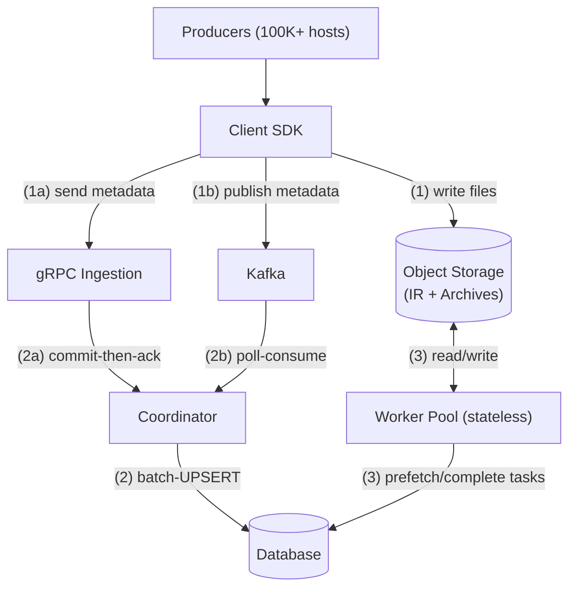
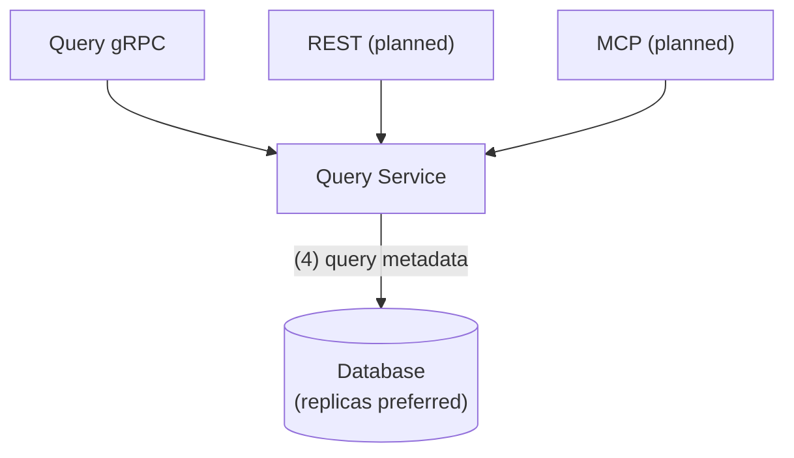
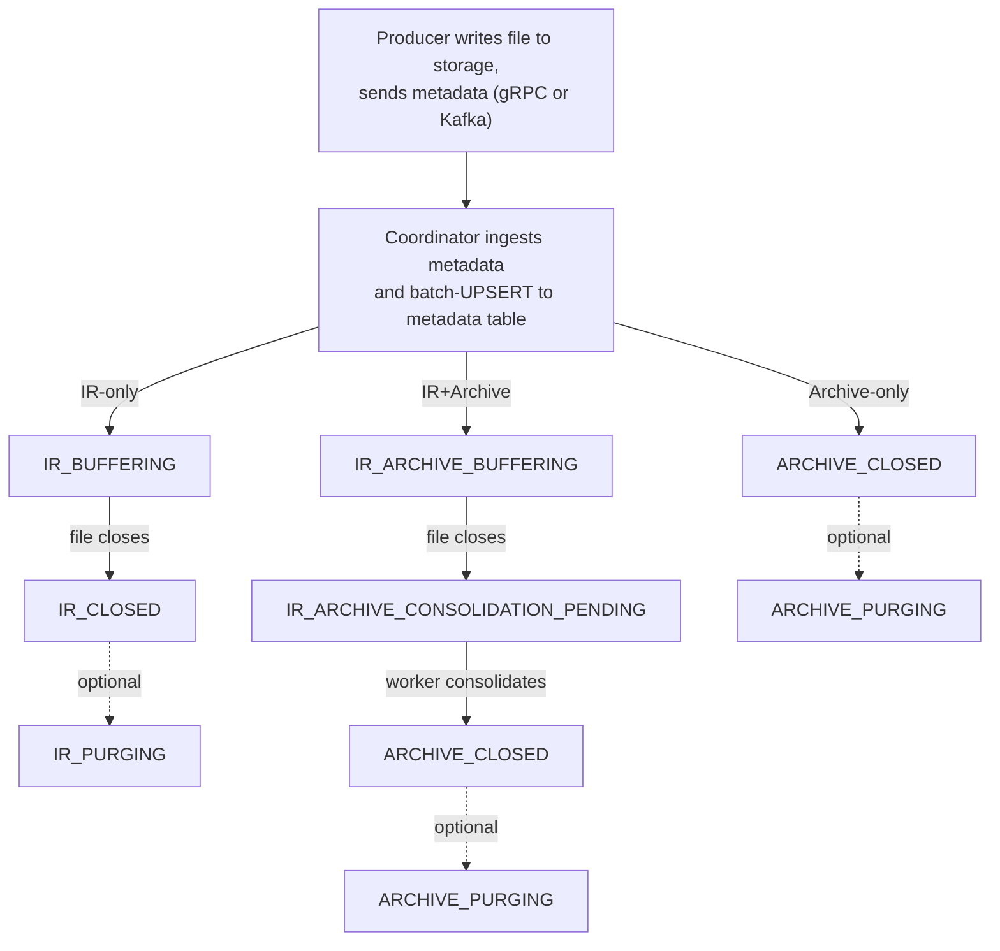

# Architecture Overview

[← Back to docs](../README.md)

End-to-end data flow, data lifecycle, component responsibilities, goroutine model, and deployment. For a quick visual overview of the coordinator node and worker pool, see the [project README](../../README.md#architecture). For deep dives, see [Coordinator HA](../design/coordinator-ha.md) (failover, liveness, edge cases).

## Design Principles

- **Minimal moving parts** — MariaDB/MySQL is the single source of truth for metadata, task distribution, and leader election. No etcd, no ZooKeeper, no additional distributed services — even for HA.
- **Safe crash recovery** — Idempotent UPSERTs, forward-only state transitions, and monotonic lifecycle progression mean any component can restart at any time without data loss or corruption.
- **Separation of ingestion and processing** — Coordinators handle metadata writes; stateless workers handle heavy I/O (consolidation). They scale independently and never contend.

---

## End-to-End Data Flow

The [README](../../README.md#architecture) shows coordinator and worker pool internals; this section shows the external data flow.

**Ingestion and processing:**

**Data access:**

**How data flows through the system:**

1. **Ingestion** — the Client SDK writes files (IR or archives) to object storage and sends file metadata to the coordinator via gRPC (push, commit-then-ack) or Kafka (pull, poll-based consumption). IR files may be destined for consolidation into archives or left as-is.
2. **Persistence** — the coordinator batch-UPSERTs metadata to the database and generates workflow tasks (e.g., consolidation).
3. **Processing** — a `Prefetcher` batch-claims tasks from `_task_queue`; workers pull tasks from the in-memory queue, consolidate IR → Archive (semantic extraction and enrichment, PII handling), and report results back for metadata updates.
4. **Data access** — the Query Service exposes metadata via gRPC (REST and MCP planned); queries go to database replicas when available, primary otherwise.

---

## Data Lifecycle

Files exist in two formats, both using schema-free semantic compression. **IR** (Intermediate Representation) is a lightweight, streamable, appendable format semantically compressed at the edge — directly queryable even before consolidation. **Archives** are the equivalent columnar format, optimized for analytical queries and semantic search, with higher compression, richer metadata, and semantic enrichment.

The entry type determines the initial state. When retention expires, the coordinator removes the database row and deletes associated files from object storage asynchronously. The optional purging state adds crash safety: files are marked for deletion in the database before storage cleanup begins, so recovery can complete any interrupted deletions.

---

## Components

### Coordinator

Each table is owned by exactly one node at a time. The owner runs per-table lifecycle goroutines (Kafka consumer, planner, retention, deletion); every node runs shared goroutines (gRPC ingestion, BatchingWriter, HA & maintenance). Both ingestion paths feed into the BatchingWriter, which batch-UPSERTs metadata to the database. See the [README](../../README.md#architecture) for visual diagrams.

- **[Coordinator HA](../design/coordinator-ha.md)** — database-backed liveness, orphan detection, failover, edge cases
- **[Ingestion Paths](ingestion.md)** — gRPC and Kafka protocols, BatchingWriter, choosing a path

### Workers

Stateless processes that transform IR files into Archives — row-to-column transposition, semantic extraction and enrichment, PII handling, and sketch filter construction. A `Prefetcher` goroutine batch-claims tasks from the database via `SELECT ... FOR UPDATE` + `UPDATE` (READ COMMITTED isolation) and feeds them into a buffered channel; worker goroutines consume from that channel, execute independently, and report results back. The coordinator's Planner processes completions and applies all metadata updates.

- **[Scale Workers](../guides/scale-workers.md)** — scaling, troubleshooting
- **[Consolidation](consolidation.md)** — IR→Archive pipeline, policies
- **[Task Queue](task-queue.md)** — claim protocol, recovery, performance

### Query Service

Read-only metadata access via gRPC (streaming with early termination), with REST and MCP planned. All protocols share the same `QueryService` implementation. Queries go to database replicas when available, primary otherwise.

- **[gRPC API Reference](../reference/grpc-api.md)** — gRPC services, proto messages, keyset pagination, configuration

### Database

MariaDB 10.4+ or MySQL 8.0+ (auto-detected). The single source of truth for all metadata and coordination: per-table daily-partitioned metadata tables, `_task_queue` for lock-free task distribution, and automatic schema evolution for new `dim_fNN` and `agg_fNN` columns via online DDL.

- **[Metadata Schema](metadata-schema.md)** — entry types, lifecycle, denormalization rationale, partitioning
- **[Metadata Tables](../reference/metadata-tables.md)** — DDL, column reference, index reference
- **[Schema Evolution](../guides/evolve-schema.md)** — placeholder column names, registry tables, online DDL

---

## Goroutine Model

Goroutines are split across two levels: **per-coordinator** goroutines that each CoordinatorUnit owns, and **Node-level** goroutines shared across all coordinators in the process. Per-coordinator goroutines are individually enabled or disabled via `_table_config` columns.

Workers are independent of the coordinator goroutine model. Each worker node runs a single `Prefetcher` goroutine that batch-claims tasks from the database, plus N worker goroutines consuming from a shared channel. For development and testing, they run inside the same process (`worker.numWorkers` in `node.yaml`); in production, they run as separate processes (see [Scale Workers](../guides/scale-workers.md)). Partition management runs at the node level (see [Metadata Schema: Partitioning](metadata-schema.md#partitioning)).

### Per-Coordinator Goroutines (4 per table)

Each CoordinatorUnit owns these goroutines. They are created when a coordinator claims a table and stopped when it releases (via `context.Context` cancellation).

| Goroutine | Name | Reads From | Writes To | Purpose |
|-----------|------|------------|-----------|---------|
| 1 | **Kafka Consumer** | Kafka | BatchingWriter channel | Continuous metadata ingestion |
| 2 | **Planner** | Database (MVCC) | _task_queue table, InFlightSet | Task creation, policy evaluation |
| 3 | **Storage Deletion** | DeletionQueue | Object storage | Rate-limited storage cleanup |
| 4 | **Retention Cleanup** | Database | Database | Periodic DELETE of expired rows |

### Node-Level Data Path Goroutines

On the ingestion critical path. The Node creates the `BatchingWriter` at startup; `tableWriter` goroutines are lazily spawned per table on first submit.

| Goroutine | Name | Scope | Purpose |
|-----------|------|-------|---------|
| — | **BatchingWriter** | 1 `tableWriter` goroutine per active table | Batch-UPSERT metadata from both Kafka and gRPC |

Both gRPC and Kafka ingestion paths submit to the same `BatchingWriter`. Each active table gets a dedicated `tableWriter` goroutine that drains a buffered `chan *FileRecord` and batch-UPSERTs to the database.

### Node-Level HA & Maintenance Goroutines

Periodic background goroutines for coordination and housekeeping. Created once at Node startup.

| Goroutine | Name | Scope | Purpose |
|-----------|------|-------|---------|
| — | **Watchdog** | 1 per node | Monitor per-coordinator goroutine health, restart or release stalled coordinators |
| — | **Heartbeat / Lease Renewal** | 1 per node | HA liveness signal (mode set by `coordinatorHaStrategy`) |
| — | **Reconciliation** | 1 per node | Claim unassigned tables, start/stop coordinator units |
| — | **Partition Maintenance** | 1 per node | Lookahead partition creation and cleanup for all tables |

### Data Flow Paths

**Ingestion Path (gRPC → Database):**

| Step | Component | Action |
|------|-----------|--------|
| 1 | gRPC client | Sends `IngestRequest` (one record per RPC call) with file metadata |
| 2 | `IngestionGrpcService` | Converts proto records → domain objects, delegates to `IngestionService` |
| 3 | `IngestionService` | Validates records, resolves dims/aggs via `ColumnRegistry`, submits to `BatchingWriter` |
| 4 | `BatchingWriter` | Routes to per-table `tableWriter` channel, batches records, UPSERT to database |
| 5 | Response | Ack sent to client only after batch is durably committed |

**Ingestion Path (Kafka → Database):**

| Step | Component | Action |
|------|-----------|--------|
| 1 | Kafka | Produces metadata messages |
| 2 | Kafka Consumer | `Poll()` → transform → `IngestWithCallback()` submits to BatchingWriter with `Flushed chan error` |
| 3 | BatchingWriter | Routes to per-table `tableWriter` channel |
| 4 | tableWriter goroutine | Drains channel → batch-UPSERT to database → signals `Flushed` channels |
| 5 | Kafka Consumer | `drainFlushes()` checks completed flushes non-blockingly, queues offsets for commit |

The Kafka consumer runs a single-threaded poll loop: poll messages, submit to BatchingWriter with a per-record `Flushed chan error`, then non-blockingly drain completed flushes to advance Kafka offsets. No goroutine-per-message — all state is single-threaded on the poll loop.

**Task Distribution Path (Database → Workers):**

| Step | Component | Action |
|------|-----------|--------|
| 1 | Planner | Query database for `IR_ARCHIVE_CONSOLIDATION_PENDING` files (MVCC read) |
| 2 | Planner | Filter by InFlightSet → apply policy → create tasks |
| 3 | Planner | Add files to InFlightSet → INSERT to `_task_queue` table |
| 4 | Prefetcher | Batch-claims tasks from `_task_queue` with `SELECT ... FOR UPDATE` + `UPDATE` → feeds into buffered channel |
| 5 | Worker goroutine | Receives task from channel → executes → creates archive in object storage |
| 6 | Worker goroutine | Writes archive to object storage → marks task `completed` |
| 7 | Planner | Processes completed tasks → updates metadata to `ARCHIVE_CLOSED`, removes IR paths from InFlightSet, queues IR files for storage deletion |

### Shared Data Structures

| Structure | Type | Capacity | Writers | Readers |
|-----------|------|----------|---------|---------|
| BatchingWriter channel | Buffered `chan *FileRecord` per table | Configurable | Kafka Consumer, gRPC service | tableWriter goroutine (Node-level) |
| _task_queue | Database table | unbounded | Planner | Workers (via Prefetcher) |
| Prefetcher channel | Buffered `chan *Task` | batchSize × 2 | Prefetcher goroutine | Worker goroutines |
| InFlightSet | `sync.RWMutex` + `map[string]struct{}` | unbounded | Planner | Planner |

### Concurrency Patterns

| Pattern | Where Used | Benefit |
|---------|------------|---------|
| **Single Writer** | tableWriter → database metadata (1 goroutine per table) | No deadlocks, no contention |
| **MVCC Reads** | Planner ← database | Lock-free reads |
| **Buffered Channels** | BatchingWriter per-table, Prefetcher task channel | Backpressure, prevents OOM |
| **`chan error` notification** | `FileRecord.Flushed` | Kafka consumer learns when records are durably committed |
| **Context cancellation** | All goroutines | Graceful shutdown propagation |
| **Two-phase shutdown** | WorkerUnit | Stop Prefetcher first (no new claims), drain workers, force-cancel after timeout |
| **FOR UPDATE + UPDATE** | Worker → _task_queue | Transactional task claiming |

---

## Deployment

In production, coordinators and workers run as separate processes on dedicated machine pools for fault isolation and independent scaling. For development and testing, they colocate in a single Node process with shared resources (database connection pool, object storage client). See [Quickstart](../getting-started/quickstart.md) for setup and [Configuration](../reference/configuration.md) for the full reference.

### Startup Sequence

**Node-level (once):**

1. Load configuration (`node.yaml`)
2. Create shared resources (database pool, StorageRegistry)
3. Initialize coordination schema, claim tables
4. Create BatchingWriter
5. Start all coordinator units (each runs per-coordinator startup below)
6. Create `IngestionService`
7. Start gRPC server (if enabled)
8. Start Node-level goroutines: Heartbeat/Lease Renewal, Reconciliation, Partition Maintenance, Watchdog
9. Start Health Check Server (if configured)

**Per-coordinator (each claimed table):**

1. Initialize schema and components
2. **[BLOCKING]** Ensure lookahead partitions exist (one-time check)
3. Recover from restart (Kafka consumer group resumes from last committed offset)
4. Start Kafka Consumer goroutine (if enabled)
5. Start Planner goroutine (if consolidation enabled)
6. Start Storage Deletion goroutine (if deletion enabled and storage configured)
7. Start Retention Cleanup goroutine (if enabled)
8. Ready to process

### Shutdown Sequence

**Node-level:**

1. Cancel Node-level context (stops HA, Reconciliation, Partition Maintenance, Watchdog goroutines)
2. Stop Health Check Server
3. Stop gRPC server
4. Stop all coordinator units (each runs per-coordinator shutdown below)
5. Signal BatchingWriter to stop, wait for per-table goroutines to drain
6. Stop worker units (two-phase: stop Prefetcher first, drain workers with 30s timeout, then force-cancel)
7. Close shared resources (database pool, StorageRegistry)

**Per-coordinator:**

1. Cancel coordinator context (propagates to all owned goroutines)
2. Stop Kafka Consumer
3. Stop Planner
4. Stop Storage Deletion
5. Stop Retention Cleanup
6. Close unit resources (Kafka consumer client, config watchers)

### Recovery from Restart

1. Get current database timestamp
2. Wait for next second (clean timestamp boundary)
3. Delete all tasks except `dead_letter`
4. Clear InFlightSet
5. Kafka consumer group resumes from last committed offset

The consumer group ID (`clp-coordinator-{table_name}-{table_id}`) is deterministic. On restart or failover, the new owner reuses the same group ID and Kafka resumes automatically. No offset storage in the database.

---

## See Also

- [Project README](../../README.md) — Quick overview, architecture diagrams, quick start
- [Quickstart](../getting-started/quickstart.md) — Setup and first run
- [Configuration Reference](../reference/configuration.md) — Config reference
- [Performance Tuning](../operations/performance-tuning.md) — Benchmarks and tuning
- [Early Termination](../design/early-termination.md) — Count columns and query short-circuiting
- [Semantic Extraction](semantic-extraction.md) — How IR→Archive enrichment works
- [Deploy HA](../guides/deploy-ha.md) — Operational HA setup
