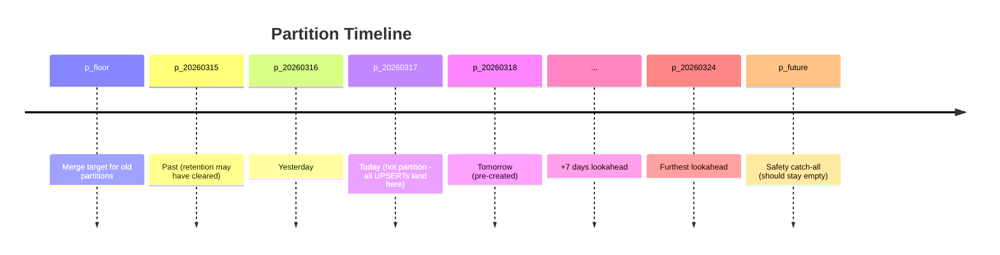
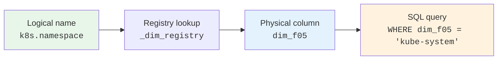
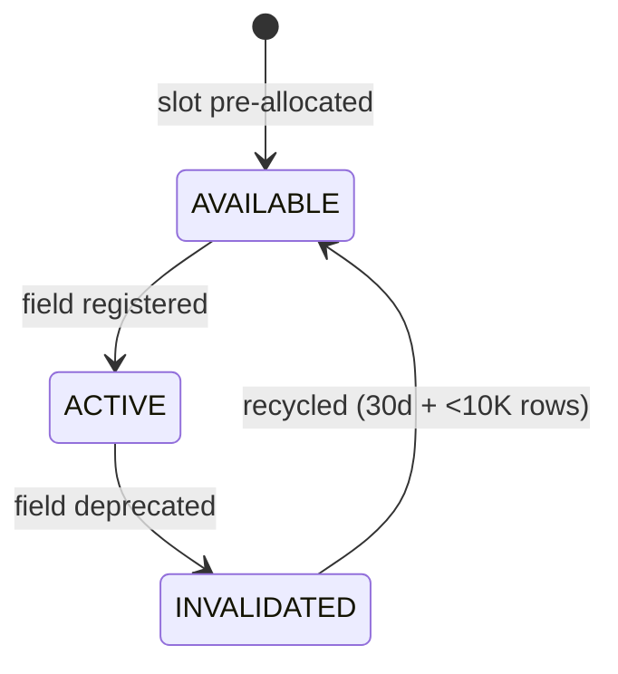
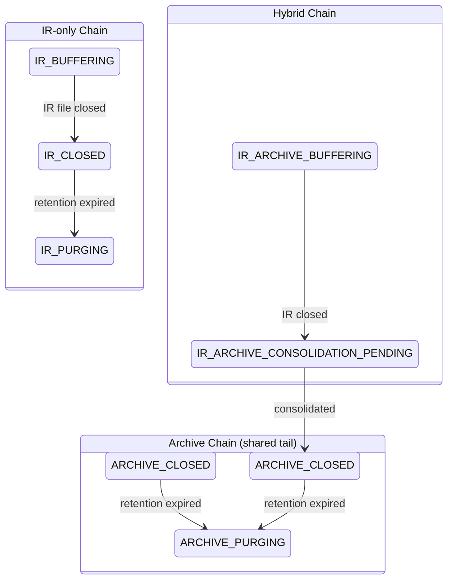
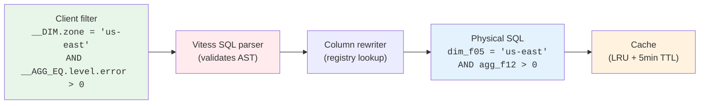

# Metalog: Database Design & Query Architecture

---

## Agenda

1. **Schema** — Data table, partitioning, virtual hash columns
2. **Registry** — Opaque placeholders, slot lifecycle, aggregations
3. **Ingestion** — Guarded UPSERT, state machine, performance
4. **Queries** — Column resolution, keyset pagination
5. **Pruning** — Bloom filters, early termination, streaming

---

## The Problem

Billions of log files in object storage. We need file-level metadata to **filter by an arbitrary combination of top-level tags** (`zone`, `level`, `trace_id`, `k8s.namespace`, ...) without opening every file.

- Tags vary across teams and applications — the metadata schema must handle any combination
- Support dynamically adding and removing tags, per-file aggregations, and sketches **without table rebuilds** (which would pause ingestion)

**Scale targets**:
- **Ingestion**: 1 billion files per 30 days per table (~400/sec sustained), with 10x burst (~4K/sec)
- **Query**: sub-second over billions of files

---

## How This Compares to CLP's Current Metadata

| | **CLP today** | **Metalog** |
|---|---|---|
| **Row model** | Two tables: one row per archive, one per file (FK) | Single denormalized row per file (IR + archive paths on same row) |
| **Schema** | Fixed columns — new field requires code change + migration | Dynamic columns via registry (`dim_f01`..`dim_f99`) — add at runtime |
| **Path indexing** | `path(768)` prefix index — only first 768 bytes; paths sharing a prefix collide | `BINARY(16)` virtual hash — full-path uniqueness in 16 bytes |
| **Partitioning** | None — single table, grows indefinitely | Daily RANGE partitions — automatic creation, cleanup, pruning |
| **Write pattern** | Simple INSERT, no dedup | Guarded UPSERT — idempotent, out-of-order safe |
| **File lifecycle** | Archive exists or it doesn't | 7-state machine, 3 chains (IR-only, hybrid, archive-only), forward-only |
| **Aggregations** | None — must open file to check contents | Pre-computed per-file stats — skip files without opening |
| **Bloom filters** | None | Per-file SBBF — probabilistic pruning before opening files |
| **Retention** | Manual cleanup | Per-file `expires_at` with automatic scanning and partition cleanup |
| **Query pagination** | Not in metadata layer | Keyset pagination — O(1) per page at any depth |

**Different roles**: CLP's metadata answers "which archives/files fall within a time range?" Metalog enables dynamic combinatory filters on per-file tags, pre-computed aggregates, and sketch-based pruning. With proper query-side support, top-N early termination can **reduce files searched by 99%** — a direct reduction in Presto query cost.

**Net effect** — more scalable, more maintainable, and significantly lower resource usage at scale:
- **Buffer pool**: daily partitions mean only today's indexes need to be cached; CLP loads all indexes for all time
- **Index size**: 16-byte hash vs 200-400 bytes per typical path (50-100 chars in utf8mb4) — roughly 12-25x smaller per entry
- **Write locality**: metalog's PK `(min_timestamp, id)` appends sequentially within today's partition; CLP's random UUID PK scatters writes across the entire B-tree
- **Ingestion scalability**: not yet measured head-to-head, but from theoretical analysis — partitioned writes into a single day's B-tree pages vs random UUID insertions across an ever-growing index — metalog should be orders of magnitude faster once files reach millions

---

## 1. Schema — The Data Table

Each managed table is cloned from `_clp_template`. One row = one file in object storage.

| Column Group | Columns | Purpose |
|-------------|---------|---------|
| **Identity & Time** | `id` (auto-increment), `min_timestamp`, `max_timestamp` | Row identity, partition key, time-range bounds |
| **IR Storage** | `clp_ir_storage_backend`, `clp_ir_bucket`, `clp_ir_path` | IR file location (NULL for archive-only entries) |
| **Archive Storage** | `clp_archive_storage_backend`, `clp_archive_bucket`, `clp_archive_path` | Archive location (NULL before consolidation) |
| **Hash Indexes** | `clp_ir_path_hash`, `clp_archive_path_hash` | Virtual hash of path for indexed lookups (16 bytes, stored only in index) |
| **Lifecycle** | `state` (7-value enum), `retention_days`, `expires_at` | File state and retention policy |
| **Metrics** | `record_count`, `raw_size_bytes`, `clp_ir_size_bytes`, `clp_archive_size_bytes` | File size and record count statistics |
| **Dimensions** | `dim_f01` .. `dim_f99` (added dynamically) | Per-file tags, mapped to logical names via `_dim_registry` |
| **Aggregations** | `agg_f01` .. `agg_f99` (added dynamically) | Per-file pre-computed statistics, mapped via `_agg_registry` |
| **Sketches** | `sketches` (SET bitmask), `ext` (MEDIUMBLOB) | `sketches`: which fields have bloom filters (mapped via `_sketch_registry`). `ext`: compressed bloom filter data |

**Indexes** (every INSERT updates all of them):

| Index | Columns | Used for |
|-------|---------|----------|
| Primary key | `(min_timestamp, id)` | Partition pruning + row identity |
| Auto-increment | `(id)` | Required by MySQL for partitioned tables |
| IR path unique | `(clp_ir_path_hash, min_timestamp)` | UPSERT duplicate detection (per-partition) |
| Archive path | `(clp_archive_path_hash)` | Archive lookup (non-unique: many IRs → one archive) |
| Consolidation | `(state, min_timestamp ASC)` | Pending files, oldest first |
| Expiration | `(expires_at ASC)` | Retention scanner |
| Time range | `(max_timestamp DESC)` | Queries sorted by recency |

**Key constraint**: MySQL can only use **one index per query**. Each index above is a composite index designed to fully serve one access pattern — e.g., `(state, min_timestamp)` instead of separate indexes on each column. If a table has multiple services, you'd create `(max_timestamp DESC, service, application_id)`. But don't over-index: once a coarse-grained filter (timestamp + 1-2 tags) narrows the result set to a few thousand rows, brute-force scanning the rest is already very fast.

The table is deliberately denormalized — all dimensions, aggregations, and storage paths inline on the same row. Every query is a single-table scan with no JOINs. Batch writes (1,000 rows per statement) amortize the index maintenance cost.

---

## 1. Schema — Primary Key & Partitioning

**Primary Key: `(min_timestamp, id)`**

- MySQL requires partition key in every unique index
- Partition key first → new rows append near the end of the current partition's index tree (write locality)
- `id` is auto-incrementing — requires its own index on partitioned tables

**RANGE partitioning by `min_timestamp` (daily, UTC midnight)**

Partitioning splits one large table into smaller physical segments by time range. Each day's data lives in its own segment, so queries that filter by time only touch the relevant day(s).



- **Lookahead**: 7 days ahead, coordinated across nodes via database-level locks
- **Cleanup**: empty partitions → dropped; sparse old partitions → merged into `p_floor`
- **RAM cache**: only today's partition indexes need to fit in the buffer pool

---

## 1. Schema — Virtual Hash Columns (The MD5 Trick)

**Problem**: File paths can be up to 1024 characters. At 4 bytes/char (utf8mb4), that's 4096 bytes per index entry — exceeds MySQL's 3072-byte index key limit.

**Solution**: Store an MD5 hash as a virtual column — computed on-the-fly, never stored in the row, only materialized in the index:

`BINARY(16) AS (UNHEX(MD5(clp_ir_path))) VIRTUAL`

| Property | Detail |
|----------|--------|
| Storage | Computed on read, stored **only in index**, not in row data |
| NULL handling | `MD5(NULL) = NULL` → archive-only entries don't conflict in unique index |
| Index size | 16 bytes per entry |

**Collision probability** (birthday problem, P ≈ n² / (2 × 2¹²⁸)):

| Path cardinality | Collision probability | Context |
|-----------------|----------------------|---------|
| 1 billion | ~10⁻²¹ | Large deployment |
| 1 trillion | ~10⁻¹⁵ | Extreme scale |
| SSD bit error | ~10⁻¹⁶ per bit | Hardware baseline |

**Query pattern**: `WHERE clp_ir_path_hash = UNHEX(MD5(?)) AND min_timestamp = ?`

At 1 trillion paths, collision probability is below the SSD bit error rate. Well before this matters, the correct response is to shard across more tables.

---

## 2. Registry — The Column Registry (Schema Evolution)

**Problem**: Log fields have special chars (`@timestamp`, `k8s.namespace`, `net/http.method`) and vary across teams.

**Solution**: Opaque placeholders `dim_f01` .. `dim_f99` mapped via `_dim_registry`.



**Three-state lifecycle** (slot recycling):



- **Online DDL**: new columns added while the table remains fully readable and writable — no downtime, no lock
- **Recycler**: after 30 days + fewer than 10K non-NULL rows → slot becomes AVAILABLE again
- **No table rebuild** needed for recycling — just a registry state change
- **Limits**: 99 dim slots + 99 agg slots + 64 sketch slots

Same pattern for aggregations (`agg_f01`..`agg_f99`) and sketches (`s01`..`s64` in a SET column — a bitmask holding up to 64 named flags, pre-allocated to avoid a table rebuild).

---

## 2. Registry — Aggregation Columns

Each `agg_fNN` stores a **pre-computed statistic** about the file's contents.

**Composite key**: `(agg_key, agg_value, aggregation_type)`

| Example | Meaning |
|---------|---------|
| `("level", "error", "EQ")` | Count of records where `level = "error"` |
| `("status_code", "500", "GTE")` | Count of records where `status_code >= 500` |
| `("response_time", "", "AVG")` | Average response time across all records |
| `("bytes", "", "SUM")` | Sum of bytes in this file |

**Value types**: `INT` (BIGINT) or `FLOAT` (DOUBLE). Same registry pattern as dimensions: three-state lifecycle, online DDL for new slots.

---

## 3. Ingestion — File Lifecycle & Idempotent Delivery

Each metadata row tracks a file through its lifecycle: **IR → consolidation → archive**. The schema supports all three paths (IR-only, hybrid, archive-only) with two sets of path columns on the same row.

**Designed for idempotent, out-of-order delivery**:

- **Forward-only state machine**: stale messages with an earlier state are silently ignored
- **Monotonic timestamp guard**: updates only apply if `new.max_timestamp > current.max_timestamp` — replays are no-ops
- The system **converges to the correct state regardless of message ordering**

---

## 3. Ingestion — Guarded UPSERT

UPSERT = "insert the row; if it already exists (duplicate key), update it instead." We add **IF guards** to control which updates are allowed:

```sql
INSERT INTO `my_table` (min_timestamp, id, state, max_timestamp, dim_f01, ...)
VALUES (?, ?, ?, ?, ?, ...), (?, ?, ?, ?, ?, ...)
ON DUPLICATE KEY UPDATE
  `state` = IF(
    `state` NOT IN ('IR_PURGING','IR_ARCHIVE_CONSOLIDATION_PENDING',
                     'ARCHIVE_CLOSED','ARCHIVE_PURGING')
    AND new.`max_timestamp` > `max_timestamp`,
    new.`state`, `state`
  ),
  `dim_f01` = IF(guard, new.`dim_f01`, `dim_f01`),
  -- ... more guarded columns ...
  `max_timestamp` = IF(guard, new.`max_timestamp`, `max_timestamp`)
  -- ↑ MUST be last (guard references it)
```

**Guard prevents**:
- **State regressions**: can't overwrite `ARCHIVE_CLOSED` with `IR_BUFFERING`
- **Stale re-deliveries**: `new.max_timestamp > max_timestamp` ensures monotonic progress
- **Critical ordering**: `max_timestamp` must be the last assignment — MySQL evaluates assignments left-to-right, and the guard reads the current value

**Batching**: records buffered and flushed when **either** threshold is met:
- **5,000 records** accumulated → flush immediately (throughput)
- **1 second** elapsed → flush what we have (latency bound)

Each flush is split into single INSERT statements with up to 1,000 rows in the VALUES clause. Delivery guarantee: **at-least-once** — the guard handles replays.

---

## 3. Ingestion — File State Machine



**7 states, 3 chains** — chosen at creation, cannot change:

| Chain | Entry point | Path |
|-------|------------|------|
| IR-only | `IR_BUFFERING` | → `IR_CLOSED` → `IR_PURGING` |
| Hybrid | `IR_ARCHIVE_BUFFERING` | → `IR_ARCHIVE_CONSOLIDATION_PENDING` → `ARCHIVE_CLOSED` → `ARCHIVE_PURGING` |
| Archive-only | `ARCHIVE_CLOSED` | → `ARCHIVE_PURGING` |

**Enforcement** — two layers, both forward-only:
1. **Application**: `CanTransitionTo()` validates every transition before writing
2. **Database**: guarded UPSERT refuses to update rows in protected states

**Retention**: `expires_at` is the authoritative per-file expiration. It can be extended independently of `retention_days` (e.g., security incident hold).

---

## 3. Ingestion — Why Is It Fast?

Every design decision compounds:

```
┌──────────────────────────────────────────────────────────────────┐
│  Daily partitions                                                 │
│  └─ Only today's indexes live in the buffer pool                  │
│     └─ Index updates hit RAM, not disk                            │
│                                                                   │
│  Hash columns (16 bytes vs 200-400 bytes per typical path)        │
│  └─ Smaller indexes = more entries per page = fewer splits        │
│     └─ Duplicate check on UPSERT is a single-page lookup          │
│                                                                   │
│  Batch INSERT (1,000 rows/statement, 5,000 records/flush)         │
│  └─ Amortizes: network round-trip, SQL parse, index maintenance   │
│     └─ Database batches disk writes within one statement           │
│                                                                   │
│  Per-table goroutines (BatchingWriter)                             │
│  └─ Tables flush in parallel — no cross-table lock contention     │
│     └─ Each table has independent indexes and cache pages          │
│                                                                   │
│  Guarded UPSERT (no read-then-write round-trip)                   │
│  └─ Single SQL statement = one lock acquisition per row            │
│     └─ IF() guard evaluated inside the database engine             │
└──────────────────────────────────────────────────────────────────┘
```

**Measured throughput** (all per writer thread):

| Path | Measured | vs. Sustained (~400/sec) | vs. 10x Burst (~4K/sec) |
|------|---------|-------------------------|-------------------------|
| gRPC push (MariaDB) | ~32K/sec | ~80x headroom | ~8x headroom |

Each table has its own writer goroutine — multiple tables multiply throughput with no cross-table contention.

---

## 4. Queries — Resolution Pipeline

Three namespaces with prefixes:

| Prefix | Resolves to | Example |
|--------|------------|---------|
| `__FILE.<col>` | Physical file column | `__FILE.max_timestamp` → `max_timestamp` |
| `__DIM.<key>` | Dimension via registry | `__DIM.zone` → `dim_f05` |
| `__AGG_<TYPE>.<key>.<value>` | Aggregation via registry | `__AGG_EQ.level.error` → `agg_f12` |



**Cache key**: `{table}:{registryVersion}:{filter}` — auto-invalidates on schema evolution.

**Safety** (defense-in-depth via Vitess parser): rejects subqueries, function calls, aggregates. Only allows comparisons, boolean logic, column refs, and literals.

---

## 4. Queries — Keyset Pagination (No OFFSET)

**Problem**: `OFFSET N` scans and discards N rows → O(N²) total work for deep pages.

**Solution**: Keyset cursor = last row's sort values + ID tiebreaker.

```sql
-- Page 1: no cursor
SELECT ... ORDER BY max_timestamp DESC, id ASC LIMIT 100

-- Page 2: cursor from last row of page 1
SELECT ... WHERE
  (max_timestamp < 1710700000000000000)
  OR (max_timestamp = 1710700000000000000 AND id > 42)
ORDER BY max_timestamp DESC, id ASC LIMIT 100
```

**General N-column case** (OR-of-prefix-equalities):

```
(f1 < v1)                                         -- f1 strictly past cursor
OR (f1 = v1 AND f2 > v2)                          -- f1 tied, f2 breaks it
OR (f1 = v1 AND f2 = v2 AND id > cursor_id)       -- all tied, id tiebreaker
```

Each operator is `<` for DESC columns, `>` for ASC columns.

- O(1) per page regardless of depth — index seek, not scan
- Indexed sort columns avoid in-memory sort — data comes out pre-ordered
- Time-range queries automatically skip irrelevant daily partitions
- NULL cursor values rejected — SQL comparisons with NULL return UNKNOWN, silently returning zero rows

---

## 5. Pruning — Sketches & Bloom Filters

**Problem**: Even after dimension/aggregation filtering, thousands of matching files may remain.

**Solution**: Per-file **Split Block Bloom Filters** (SBBF, Parquet-compatible).

- Stored in `ext` column as a binary blob (LZ4-compressed, msgpack-encoded)
- `sketches` bitmask indicates which fields have bloom filters (e.g., `'s01','s03'`)
- 64 sketch slots pre-allocated (MySQL bitmask limit), no schema change needed

**Conditional blob fetch** — only transfer the blob for rows where it's useful:

```sql
-- If this row has a bloom filter for field s03, return the blob; otherwise NULL
SELECT ...,
  IF(FIND_IN_SET('s03', sketches) > 0, ext, NULL) AS `ext`
FROM my_table
WHERE dim_f05 = 'us-east'
```

**Client-side evaluation**:
1. Decompress LZ4, decode msgpack
2. Hash search value with xxHash64 (seed 0)
3. Probe the Split Block Bloom Filter (32 bytes/block)
4. False positive → safe (file opened unnecessarily). False negative → impossible.

---

## 5. Pruning — Why Are Queries Fast?

Every technique compounds — each layer eliminates work before the next:

```
┌──────────────────────────────────────────────────────────────────┐
│  "Find 100 files with errors from us-east containing uuid X"     │
│  ORDER BY max_timestamp DESC LIMIT 100                            │
│                                                                   │
│  Level 1: Partition Pruning (exact)                               │
│  └─ RANGE on min_timestamp → skip entire partitions               │
│     └─ "Last hour" query: 1 partition scanned out of 30+          │
│                                                                   │
│  Level 2: Dimension Filters (exact)                               │
│  └─ dim_f05 = 'us-east' → indexed lookup                         │
│     └─ Only matching rows read from disk                          │
│                                                                   │
│  Level 3: Aggregation Filters (exact)                             │
│  └─ agg_f12 > 0 (error_count) → skip files with zero errors      │
│     └─ No need to open the file in object storage                 │
│                                                                   │
│  Level 4: Sketch Bloom Filters (probabilistic, false-positive safe│)
│  └─ uuid bloom probe → prune files that definitely lack uuid X    │
│     └─ Conditional blob fetch: only transfer ext for relevant rows│
│                                                                   │
│  Watermark: 100th file's min_timestamp = T                        │
│  └─ Any partition entirely before T → pruned without scan         │
│     └─ Each page tightens the watermark                           │
│                                                                   │
│  Keyset pagination: O(1) per page at any depth                    │
│  └─ Index seek, not scan-and-discard like OFFSET                  │
│                                                                   │
│  Denormalized fact table: single table, no JOINs                  │
│  └─ Every filter is an indexed lookup on the same table           │
└──────────────────────────────────────────────────────────────────┘
```

- Levels 1-3 are **100% accurate** — no estimation, no false positives
- Level 4 has false positives (safe) but **no false negatives**
- Watermark tightens with each page → recent-data queries often touch only 1-2 partitions
- At billion-file scale, a typical query touches a tiny fraction of the data

---

## 5. Pruning — Streaming & Prefetching

`StreamSplitsAsync()`: background producer goroutine fetches pages ahead of consumer.

```
┌─────────────────────────────────────────────────────────────┐
│                    StreamSplitsAsync                         │
│                                                             │
│   Producer goroutine              Consumer (foreground)     │
│   ┌──────────────────┐           ┌──────────────────┐      │
│   │ executePage(N)   │──────────→│                  │      │
│   │ executePage(N)   │  channel  │  consumer(split) │      │
│   │ executePage(N)   │ (2×page)  │  keepGoing?      │      │
│   │ ...              │──────────→│                  │      │
│   └──────────────────┘           └──────────────────┘      │
│                                                             │
│   • Channel buffer: 2 × pageSize (one page ahead)          │
│   • Consumer returns keepGoing=false → producer cancels     │
│   • Sketch bloom filters evaluated per-row in producer      │
│   • Exhaustion: DB returns < pageSize → producer stops      │
└─────────────────────────────────────────────────────────────┘
```

The producer stays one batch ahead of the consumer. Early termination is clean: cancel the producer context, drain the channel.

---

## Summary

| Layer | Technique | Benefit |
|-------|-----------|---------|
| **Table** | Denormalized fact table + daily partitions | Hot data fits in RAM, time queries skip cold partitions |
| **Schema** | Registry-based evolution (online DDL, slot recycling) | No rebuilds, arbitrary field names |
| **Ingestion** | Guarded UPSERT + per-table goroutines | Idempotent, at-least-once, absorbs 10x burst |
| **Queries** | Keyset pagination + 4-level early termination | Sub-second over billions of files |

| Metric | Value |
|--------|-------|
| Target | 1B files / 30 days per table (~400/sec sustained) |
| Burst (10x) | ~4K/sec |
| Measured | 10K-32K/sec per writer thread (25-80x headroom) |
| Dimension slots | 99 (`dim_f01`..`dim_f99`) |
| Aggregation slots | 99 (`agg_f01`..`agg_f99`) |
| Sketch slots | 64 (`s01`..`s64`) |

---

## Source Reference

| Area | File |
|------|------|
| Full DDL | `schema/schema.sql` |
| Guarded UPSERT | `metastore/filerecords_upsert.go` |
| File states | `metastore/model.go` |
| Column registry | `schema/columnregistry.go` |
| Partition manager | `schema/partitionmanager.go` |
| Schema evolution | `schema/evolution.go` |
| Query engine | `query/engine.go` |
| Column resolution | `query/resolve.go` |
| Filter validation | `query/filter.go` |
| Sketches | `query/sketch.go`, `sbbf.go` |
| Batch writer | `coordinator/ingestion/batchingwriter.go` |
